#  **Real-Time Flight Data Visualization Dashboard** 

## 📖 Table of Contents
- [📌 Project Overview](#project-overview)
- [🔑 Key Features](#key-features)
- [🛠️ Technologies Used](#technologies-used)
- [🏛️ Brief Description & Architecture](#brief-description--architecture)
- [🐳 Dockerized Environment](#dockerized-environment)
- [☸️ Deployment Strategy & Kubernetes Architecture](#deployment-strategy--kubernetes-architecture)
- [🔧 Setup and Usage](#setup-and-usage)
- [⚙️ Services](#services)
- [🖥️ Results](#results)
- [🔮 Limits & Future Considerations](#limits--future-considerations)


## 📌 Project Overview  

This project, developed by Hiba Daoud as part of her academic journey at the University of Trento, delivers a **Real-Time Flight Data Visualization Dashboard** offering an interactive platform to monitor live flight data, airport details, and aircraft statistics. The project incorporates a production-grade system deployment pipeline, leveraging **Docker-based containerization**, automated **CI/CD workflows**, and **Kubernetes orchestration** to enable scalable and reliable application delivery, complemented by integrated **monitoring and observability** mechanisms.

### **Project Requirements**

- **Layered Architecture Implementation**:
    - Data Layer    
    - Adapter Layer  
    - Business Logic Layer   
    - Process-Centric Layer
    - Visualization Layer
- **Authentication & Authorization System**:
    - Implement JWT-based authentication, requiring a token to access specific API endpoints.
- **Use of a Database Management System**
- **Defined Data Structures**:
   - Inputs and outputs for services are JSON-based, with clear schema definitions provided for external and internal data exchanges.
- **General Design Principles:**
    - **Modular** and **Scalable** services designed for reusability and easy scaling across different environments.  
    -  Services interact exclusively through **REST APIs** for standardized communication.  
    - **Internal and External Integration**: Incorporates external flight data API and internal data processing and visualization components.  
- **Deployment**
    - Entire system is containerized using **Docker** for portability and scalability.
    - **Automated CI/CD Pipeline** for continuous integration, testing, and deployment.
    - **Kubernetes Orchestration** for production deployment.
    - **Monitoring & Observability**:
        - The system must provide continuous monitoring to detect service failures and anomalies in real time.
        - Performance metrics (latency, throughput, responsiveness) must be collected to identify bottlenecks.
        - Monitoring data must support resource planning, capacity management, and scaling decisions.

## 🗝️ Key Features

### ✈️ Real-Time Flight Data Processing
- **Kafka Integration:** A Kafka producer-consumer system is used for streaming real-time flight data from an **external API: Airlabs Data API** 
- **PySpark Consumer:** Consumes flight data from Kafka in real-time, processes and transforms the data for meaningful insights.
- **Elasticsearch Integration:** Stores processed data in Elasticsearch for fast querying and retrieval of flight data.

### 📊 Interactive Data Visualization
- **Kibana Dashboard:** Displays real-time flight data, airports details, and aircafts statistics.

### 🌐 Interactive Web Application 
- **User Authentication:** Secure login and registration system with **token authorization**. User-related data are stored in **MongoDB**
- **Dynamic Dashboard:** Embedded Kibana dashboard using an iframe for real-time data visualization.

### 🏗️ Microservices Architecture 
- **Process-Centric API:** Coordinates user-triggered actions, such as data fetching.
- **RESTful APIs:** Enables interaction between services through clearly defined endpoints.
- **Reusable and Scalable:** Each service is modular and can be extended for other use cases.

### 🐳 Containerized Deployment
- **Dockerized Services:** All services are containerized for portability, scalability, and isolation across development and production.
- **Health Monitoring:** Readiness and liveness probes for all services.
- **Container Orchestration:** Docker Compose manages service dependencies and networking.

### 🚀 Automated CI/CD Pipeline 
- **Continuous Integration:** Automated workflows are triggered on code changes to perform linting, testing, and validation.
- **Multi-Stage Pipeline:** The **Gitlab CI** pipeline includes build, test, containerization, and deployment stages to ensure code quality and delivery reliability.
- **Automated Testing:** Comprehensive test suite including unit tests, service tests, and integration tests.
- **Image Management:** Docker images are automatically built and published to a container registry as part of the pipeline.
- **Deployment Automation:** Validated artifacts are deployed automatically to the target environment, ensuring repeatable releases.


### ☸️ Kubernetes-Based Deployment
- **Production Orchestration:** The system is deployed on a **Microsoft Azure Kubernetes Service (AKS)** cluster to support scalability, fault tolerance, and high availability.
- **Resource Management:** CPU and memory requests and limits are defined per service to ensure stable operation under varying workloads.
- **Secure Access:** TLS certificates are managed automatically, using **Let's Encrypt**, to secure external access to the system.

### 📊 Monitoring & Observability
- **Resource Utilization Tracking:** CPU and memory usage are monitored at both pod and node levels to support capacity planning and cluster sizing.
- **Operational Insights:** Monitoring data is used to guide resource tuning, scaling decisions, and infrastructure optimization.

## 🛠️ **Technologies Used**

| **Technology**        | **Purpose**                                                                 |
|-----------------------|-----------------------------------------------------------------------------|
| Kafka                 | Acts as a message broker for real-time data streaming.                     |
| PySpark               | Processes, transforms, and enriches real-time flight data.                 |
| Elasticsearch         | Indexes processed data for visualization in Kibana.                        |
| Kibana                | Provides real-time data visualization on a Dashboard.              |
| Node.js (Express)     | Handles user authentication and user-triggered actions.           |
| MongoDB               | Stores user credentials.                               |
| HTML, CSS, JS         | Builds the web interface.                                                   |
| Docker                | Manages services in isolated and consistent environments.                  |
| GitLab CI/CD          | Automates continuous integration, testing, and deployment.                |
| Kubernetes            | Orchestrates container deployment and scaling in production.               |
| cert-manager          | Automates SSL/TLS certificate lifecycle management.                        |
| Let's Encrypt         | Provides free SSL certificates for secure HTTPS access.                    |
| Prometheus            | Collects and stores metrics for monitoring and alerting.                   |
| Grafana               | Creates dashboards for visualizing metrics and system performance.         |
| Jest                  | Unit testing framework for Node.js backend services.                       |
| pytest                | Unit testing framework for Python services (Kafka, Spark, Elasticsearch).  |
| ESLint                | Code quality and style checking for JavaScript code.                        |
| Flake8                | Code quality and style checking for Python code.                           |

## 🏛️ Brief Description & Architecture 
### 🧩 Core Application Architecture
The web application features **JWT-based authentication** for secure user access, with credentials safely stored in **MongoDB**. After a successful login  and using **token authorization**, users are directed to a **Kibana dashboard** that displays **real-time flight data** from the **Airlabs API**, offering detailed information on air traffic and airport density.

The data flow starts with a **Kafka producer** that publishes flight data to the `flight` topic. **Apache Spark** subscribes to this topic, processes the data, and forwards the results to **Elasticsearch**, where they are stored in the `esflight` index.

The **Kibana dashboard**, embedded directly within the web application, visualizes the processed data in real time, providing users with a seamless, interactive experience.


#### **1. Data Layer**  
Manages and stores persistent data:
- **MongoDB**: Handles user authentication data (email,password).  
- **Elasticsearch**: Stores and queries processed real-time flight data visualized in Kibana.

#### **2. Adapter Layer**  
Connects external API with internal systems:
- **Kafka**: Ingests and distributes real-time flight data.  
- **Python Requests**: Fetches data from **Airlabs Data APIs** and sends it to Kafka for processing.

#### **3. Business Logic Layer**  
Manages core functionality and processing:
- **Pyspark**: Processes real-time flight data from Kafka, transforms it and indexes it into Elasticsearch.  
- **Node.js (Express)**: Implements backend logic, including user authentication.

#### **4. Process-Centric Layer**  
Coordinates user actions and system workflows:
- **Node.js (Express)**: Provides REST APIs for login, registration, fetching real-time data, and triggering producer actions.

#### **5. Vizualization Layer**  
Presents real-time processed data to the end user through a user-friendly interface
- **Kiabana**: Visualizes real-time flight data using an interactive dashboard.
- **HTML, CSS, JS**: Builds the web interface for user authentication and embedding Kibana for real-time visualization.
- **Nginx**: Serves the frontend and routes requests to the backend.

### 🚀 CI/CD Architecture Overview
The project implements a **fully automated CI/CD pipeline** designed to ensure **code quality, security, reliability, and controlled deployments**. The pipeline follows DevOps best practices by separating **Continuous Integration (CI)** from **Continuous Deployment (CD)**, enabling rapid feedback while maintaining production stability.

Every code change pushed to the repository automatically triggers the pipeline, where the application is tested, containerized, scanned, and deployed to a **Kubernetes cluster on Azure**.

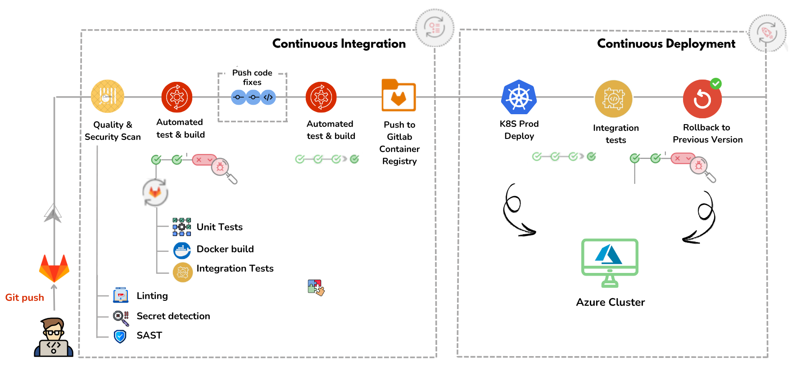

---

#### **1. Source & Trigger Layer**
Handles version control and pipeline triggering:
- **GitLab Repository**: Acts as the single source of truth for application code and pipeline configuration.
- **Git Push Events**: Automatically trigger the CI pipeline on every commit or merge request.

#### **2. Continuous Integration (CI) Layer**

Ensures code quality, security, and build reliability before deployment:

- **Linting**: Enforces code style and detects syntax issues early.
- **Unit Tests**: Validates individual components and application logic.
- **Integration Tests**: Verifies interactions between services.
- **Docker Build**: Builds container images for all services in a reproducible environment.
- **Security & Quality Scans**:
  - **Secret Detection**: Prevents credential leakage.
  - **SAST (Static Application Security Testing)**: Identifies potential vulnerabilities in source code.

If any stage fails, the pipeline stops, preventing unstable code from progressing further.

#### **3. Artifact & Registry Layer**

Manages versioned and deployable artifacts:

- **GitLab Container Registry**: Stores validated Docker images produced during the CI stage.
- Each image is tagged and versioned to support traceability and rollbacks.

#### **4. Continuous Deployment (CD) Layer**

Automates application deployment to production infrastructure:

- **Kubernetes Deployment (Azure Cluster)**: Pulls validated images from the registry and deploys them to the production environment.
- **Rolling Updates**: Ensures zero-downtime deployments by gradually replacing running containers.
- **Integration Tests (Post-Deploy)**: Confirms that deployed services function correctly in the production environment.

#### **5. Rollback & Reliability Layer**

Guarantees system stability in case of failure:

- **Manual Rollback**: If post-deployment tests fail or health checks are not satisfied, we manually rollback to the previous stable version.

### 📊 Monitoring & Observability Architecture Overview
The system integrates a **lightweight monitoring stack** based on **Prometheus and Grafana** to provide **real-time observability** of the Kubernetes environment. This monitoring layer enables continuous visibility into **cluster health, resource usage, and application performance**, ensuring operational reliability.

Prometheus continuously collects metrics from the **Kubernetes cluster**, while Grafana visualizes these metrics through interactive dashboards, allowing operators to quickly detect anomalies and performance bottlenecks.


---
#### **1. Metrics Collection Layer**

Responsible for gathering operational data from the infrastructure:
- **Kubernetes Cluster**: Exposes metrics related to nodes, pods, and system resources.
- **Prometheus**: Periodically scrapes metrics from Kubernetes endpoints and stores them in a time-series database optimized for monitoring data.

#### **2. Metrics Storage & Processing Layer**

Handles metric persistence and querying:
- **Prometheus Time-Series Database (TSDB)**: Stores historical and real-time metrics, enabling efficient querying and trend analysis over time

#### **3. Visualization & Observability Layer**

Provides real-time insights and system visibility:
- **Grafana**: Connects to Prometheus as a data source and renders metrics through customizable dashboards.
- Dashboards display key indicators such as **CPU usage, memory consumption, pod status, and cluster health**, enabling proactive monitoring.


## 🐳 Dockerized Environment
To ensure seamless operation and management, our project is built upon a Dockerized environment, encapsulating each component of the system within its own container. This approach not only fosters a modular architecture, making it easier to update and maintain individual parts without affecting the whole system, but also enhances scalability and fault tolerance. 

Each service in the system, operates in an isolated yet interconnected manner through a custom Docker network.


## ☸️ Deployment Strategy & Kubernetes Architecture

The application is deployed on a **Kubernetes cluster** using a declarative approach based on **YAML manifests**, where each component is described through Kubernetes objects defining its desired state. This strategy ensures **scalability, resilience, and modular deployment** across the cluster.

### **1. Kubernetes Objects Used**
The deployment relies on the following core Kubernetes resources:

- **Deployments**: Used for stateless services such as the **frontend**, **backend**, and **Spark**, ensuring replica management and smooth rolling updates.
- **StatefulSets**: Used for stateful components including **Kafka**, **Zookeeper**, **MongoDB**, **Elasticsearch**, and **Kibana**, providing stable identities and persistent storage.
- **Services (ClusterIP)**: Enable internal communication between application components by exposing stable virtual endpoints.
- **ConfigMaps & Secrets**: Store configuration parameters and sensitive data (credentials, tokens) securely.
- **PersistentVolumeClaims (PVCs)**: Ensure data persistence for stateful services across pod restarts.
- **Ingress**: Exposes the application externally through a public URL with **HTTPS support**, routing traffic to frontend and backend services.

### **2. End-to-End Request Flow**
Users access the platform via a public URL managed by the **Ingress Controller**. Incoming requests are routed to the **frontend service**, which communicates with the **backend service** for authentication and business logic. Internal traffic flows between backend components (Kafka, MongoDB, Elasticsearch, Spark) across multiple worker nodes, enabling full application functionality.

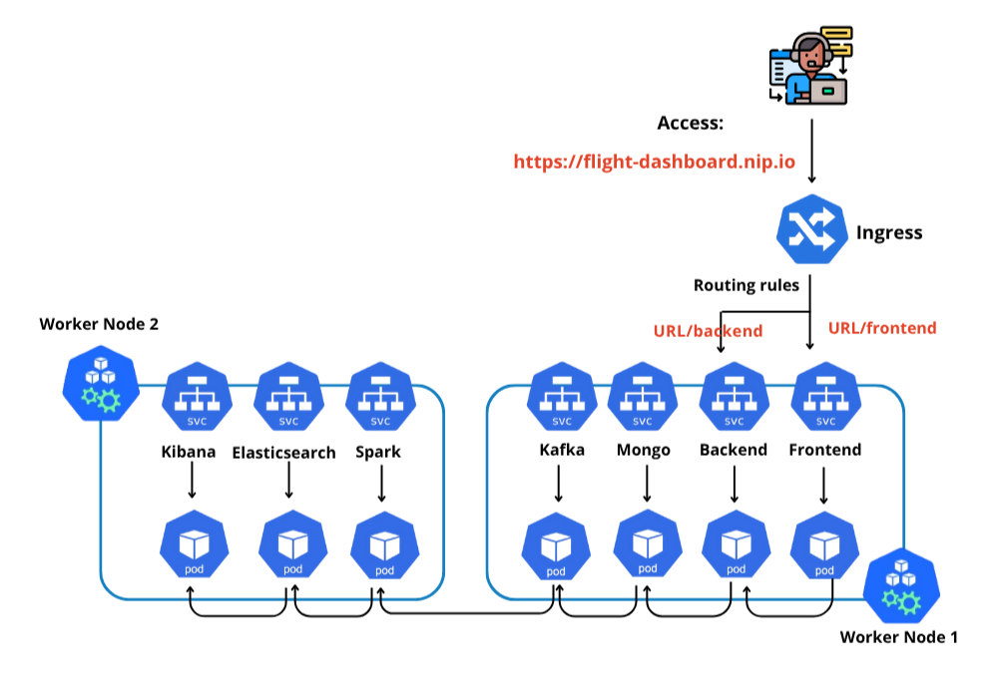

### **3. Deployment Workflow**

Before cloud deployment, the system was validated locally using **Kind (Kubernetes in Docker)** to simulate a production-like environment. Once validated, the same Kubernetes manifests were deployed automatically to **Microsoft Azure** using **GitLab CI/CD**, ensuring consistency between local and cloud environments.

This two-step deployment approach improves reliability, reduces cloud costs, and enables faster iteration while maintaining production stability.


## 🔧 Setup and Usage
In order to see the web application with Real Time visualization Dashboard you just need to:
- create a `.env` file, in the same directory as `docker-compose.yml`,  with the following content:
    ```
    MONGO_INITDB_ROOT_USERNAME=<mongo_username>
    MONGO_INITDB_ROOT_PASSWORD=<mongo_password>
    MONGO_INITDB_DATABASE=auth_db
    MONGO_URI=mongodb://mongo:27017/auth_db?authSource=admin
    API_URL = "https://airlabs.co/api/v9/flights?api_key=<your-key>"
    ```
- In the backend directory, create a `.env` file with the following content:
    ```
    SECRET_KEY=<your secret key>
    ```
    You can obtain it executing these commands in the terminal after installing `node` from the source web page
    ```
    node
    require('crypto').randomBytes(64).toString('hex')
    ```
- Start `docker-compose.yml`:
    ```bash
        docker-compose up -d
    ```
- Access the web application via `http://localhost:8080`.
- The landing page provides navigation options to login or register.
- Upon successful login, the Kibana dashboard is displayed with Real Time data
- The button Fetch Real Time Data is used for retrieving new data when needed.

> [!NOTE]
> Note that this is only for seeing results directly but we will detail every service and its usage in the next section.

## ⚙️ Services
### Kakfa service: 
- Kafka is used as a message broker, enabling real-time data streaming. It fetches data from Airlabs API using `api_key` and distributes it for processing and visualization.
- **Services in `docker-compose.yml`**
    - **Zookeeper**: `docker.io/bitnami/zookeeper:3.8`
        - Coordinates and manages Kafka brokers.
        - Required for Kafka to function properly.
    - **Kafka**: `docker.io/bitnami/kafka:3.3`
        - Streams real-time data using topics.
        - Acts as the backbone for data ingestion and distribution.
- **Producer:** Publishes flight data fetched from the Airlabs API into a Kafka topic (flights).
    - `Producer({'bootstrap.servers': 'kafka:9093'})`: Connects the producer to Kafka inside the Docker network to publish messages to a topic. Used in `producer_app.py` because the producer is launched from the backend service, triggered by a user action. This communicates with Kafka internally within the Docker network.
    - `Producer({'bootstrap.servers': 'localhost:9092'})`: Connects the producer to Kafka outside Docker via the host's port to publish messages. Used in `producer.py` to manually test and launch the producer independently. This setup allows testing Kafka locally and running the consumer locally to observe the output of the Kafka service independently.
- **Consumer:** Subscribes to the flights topic, retrieves data, and stores it in `fetched_data.json`
    ```
        consumer = Consumer({
        'bootstrap.servers': 'localhost:9093' ,
        'group.id': 'my-group',                
        'auto.offset.reset': 'earliest'      
        })
    ```
- **Steps to Launch Kafka and retrieves data Locally**
    - Start `docker-compose.yml`:
        ```
        docker-compose up -d
        ```
    - Install Python Dependencies: In the Kafka directory, install the required Python packages:

        ```
        pip install requests confluent_kafka python-dotenv
        ```
    - In the Kafka directory, create a `.env` file with the following content:
        ```
        api_url="https://airlabs.co/api/v9/flights?api_key=<your-key>"
        ```
    - Start the Producer
        ```
        python kafka/producer.py
        ```
    - **In another terminal**, start the Consumer
        ```
        python kafka/consumer.py
        ```
        This will generate a `fetched_data.json` file containing the retrieved and processed data.

### Spark Service: 
The Spark service processes real-time flight data retrieved from the Kafka topic, enriches it with additional information (e.g., airport names, flight types), and stores it in Elasticsearch for visualization in Kibana.
**The Spark service communicates with Kafka and Elasticsearch services using internal APIs as they are all in the same network.**

- **Services in `docker-compose.yml`**
    - **spark-master** : `hiba25/flight-dash:spark-master`
        - Custom image built from `spark/Dockerfile` to install Python dependencies, Scala, and configure Spark with specific scripts.
        - Acts as the master node of the Spark cluster.  
    - **spark-worker-1** : `hiba25/flight-dash:spark-worker-1`
        - Custom image built from `spark/Dockerfile`. Shares the same build as Spark Master for consistency.
        - Acts as a worker node to assist the master node in processing tasks.  
        - Connects to the Spark master at `spark://spark-master:7077`.

- **Steps Performed in `spark_stream.py`**
    - **Reading from Kafka:**
        - Subscribes to the Kafka topic `flights` using the broker `kafka:9092`.  
        - Consumes incoming messages in real-time.

    - **Data Enrichment:**
        - Enriches data with attributes like `type` which specify if the flight is domestic or international.  
        - Maps IATA codes (`dep_iata`, `arr_iata`) to airport details such as names and positions using `airports_external.csv` creating new fields: `Arrival`, `Departure`, `dep_pos`, `arr_pos`
        - Cleans and filters rows with missing data fields.

    - **Writing to Elasticsearch:**
        - Stores the enriched data in the Elasticsearch index `esflight`.  
        - Ensures unique records using `reg_number` as the identifier.

- **Steps to Launch Spark Locally**
    - Replace `SPARK_PUBLIC_DNS` with **your local ip** in `spark-env.sh`.
    - To see the Spark processing results independently in the console, comment out the Elasticsearch writing code and uncomment the `writeStream` section configured for console output.
    - Start `docker-compose.yml`:
        ```bash
        docker-compose up -d
        ```
    - The processed data will be printed in a table in the logs of the `spark-master` container.
        ```bash
        docker logs -f spark-master
        ```

### Elasticsearch service:   
Elasticsearch is responsible for storing and indexing the processed flight data to enable efficient querying and real-time visualization in Kibana. It depends on the Kafka service to retrieve processed data streams from the flights topic for indexing. This ensures persistent data storage, allowing historical data to remain accessible even when services are stopped or no new data is being ingested.
**The Spark Elasticsearch communicates with Kafka and Kibana services using internal APIs as they are all in the same network.**

- **Elasticsearch image**: Custom image `hiba25/flight-dash:elasticsearch` built with the necessary Elasticsearch setup from `elasticsearch/Dockerfile'.
- `custom_startup.sh`: Automates Elasticsearch initialization, waits for readiness, and creates the `esflight` index using `create_index_elastic.py`
-   `create_index_elastic.py`: Defines and creates the esflight index with necessary mappings in Elasticsearch.
- **Steps to Launch Elasticsearch**
    - Start `docker-compose.yml`:
        ```bash
        docker-compose up -d
        ```
    - Use Elasticsearch HTTP API `localhost:9200` to query data directly or ensure data is flowing into the esflight index after Spark processing:
        ```bash
        curl -X GET "localhost:9200/esflight/_search?pretty"
        ```
    - To know how much data is stored in elasticsearch browse `http://localhost:9200/esflight/_count`
    
### **Kibana Service**

Kibana serves as the **real-time data visualization** layer in this project, connecting to Elasticsearch to fetch and display processed flight data. The data is displayed in custom dashboard with insightful graphs and maps. The dashboard is embedded into the web application using an `iframe`, providing users with an interactive and seamless visualization experience.
**The Kibana service communicates with Elasticsearch and Frontend services using internal APIs as they are all in the same network.**

- **Kibana image**: Custom image `hiba25/flight-dash:kibana` built with the necessary Kiabana setup from `kibana/Dockerfile'.
- `custom_cmd.sh`:
   - Executes essential setup scripts and ensures Kibana runs smoothly.
   - Calls `load_ndjson.sh` to import the preconfigured dashboard into Kibana.
- `load_ndjson.sh`:
   - Imports saved the Kibana dashboard using the Kibana API.
   - Ensures the dashboard is available immediately after starting the Kibana container.
- `export.ndjson`:
   - Contains the exported configuration for Kibana dashboard, visualization, and saved objects.
   - Loaded into Kibana on startup to provide prebuilt visualizations.
- **Steps to Launch Kibana**
    - Start `docker-compose.yml`:
        ```bash
        docker-compose up -d
        ```
    - Browse Kibana HTTP API `localhost:5601` to visualize and interacte with data stored in Elasticsearch.
    - Go to Management > StackManagement > Kibana > Saved Objects
    - You will see Airport Managment Dashboard, click on it and vizualize the data with custom graphs
    - If not import `export.ndjson` manually.

###  Backend Service 
The backend service is **the core API for user authentication, data handling, and Kafka producer triggering.** It connects with other services, such as MongoDB for storing user credentials and Kafka for data streaming, and provides RESTful endpoints for user interactions.
- **Services Used**
    - **MongoDB** : `mongo:latest`
        - **Purpose**: Stores user authentication data (email, password, tokens).  
        - **Integration**: MongoDB is accessed via Mongoose in the `server.js` file for operations like user registration and login.
    - **Kafka**  
        - **Purpose**: Acts as the message broker for streaming flight data.  
        - **Integration**: Upon successful user login, the backend triggers the Kafka producer (`producer_app.py`) to fetch and publish real-time flight data.
    - **Node.js (Express)** `hiba25/flight-dash:backend`  
        - **Purpose**: Implements RESTful APIs for user authentication (`/register`, `/login`) and producer management (`/start-producer`).  
        - **Docker Image**: Custom image built from `backend/Dockerfile` to install Python and nodejs dependencies.
- `server.js`: Contains the API logic and middleware for authentication. It handles user authentication, token validation, and producer control.
    - **Login API**: Triggers the Kafka producer and returns a **JWT token** upon successful login.
    - **Protected API**: `/dashboard` uses JWT to allow access only to authenticated users.
- **Steps to Launch the Backend**
    - In the same directory as `docker-compose.yml`, create a `.env` file with the following content:
        ```
        MONGO_INITDB_ROOT_USERNAME=<mongo_username>
        MONGO_INITDB_ROOT_PASSWORD=<mongo_password>
        MONGO_INITDB_DATABASE=auth_db
        MONGO_URI=mongodb://mongo:27017/auth_db?authSource=admin
        API_URL = "https://airlabs.co/api/v9/flights?api_key=<your-key>"
        ```
    - In the backend directory, create a `.env` file with the following content:
        ```
        SECRET_KEY=<your secret key>
        ```
        You can obtain it executing these commands in the terminal after installing `node` from the source web page
        ```
        node
        require('crypto').randomBytes(64).toString('hex')
        ``
     - Start `docker-compose.yml`:
        ```bash
        docker-compose up -d
        ```
    - Use backend HTTP API `localhost:3000` endpoints to locally try user authentication and authorization.
        ```bash
        curl -X POST http://localhost:3000/register \
        -H "Content-Type: application/json" \
        -d '{"email": "testuser@example.com", "password": "securepassword123"}'

        curl -X POST http://localhost:3000/login \
        -H "Content-Type: application/json" \
        -d '{"email": "testuser@example.com", "password": "securepassword123"}' -o response.json

        curl -X GET http://localhost:3000/dashboard \
        -H "Authorization: Bearer <your-jwt-token>"
        ```
       `<your-jwt-token>` is stored in `response.json`

### Frontend Service 
The frontend service provides an intuitive and user-friendly web interface for the Real-Time Flight Visualization Dashboard. It enables users to interact with the application for tasks such as login, Fro, and viewing real-time flight data via the embedded Kibana dashboard.
**The Frontend service communicates with Backend services using API_URL="http://localhost:3000"**

- **Steps to Launch the Backend**
    - Start `docker-compose.yml`:
        ```bash
        docker-compose up -d
        ```
    - Access the web application via `http://localhost:8080`.

## 🖥️ Results
### 🧩 Core Application Results
**Welcome Page**

**Sign In / Sign Up**


**Dashboard**


Let us now focus on the graphs developed during the data visualization process. We have chosen to divide our dashboard into three sections: airport information, flight information, and aircraft information.
#### Airport Information
For this section of the dashboard, we focused on information useful for airport administrators, notably the total number of flights related to that airport and the flow of departures and arrivals. The figure above shows an overview for all airports, but the available filters allow selecting a specific airport.


#### Flight Information
For this part of the dashboard, we visualize on the map the position of aircraft, their departure and arrival airports sorted by their speeds or altitudes as needed. Then the treemaps display the most frequent flights, grouped by aircraft type and country flag, highlighting key trends such as the dominance of aircraft models like B738 and countries like the US in air traffic operations.


#### Aircraft Information
Finally, for the section related to the aircraft itself, using the data available on the API, we can determine the average and maximum speeds of aircraft as well as their speeds relative to their altitudes to ultimately identify the fastest aircraft and rank them in descending order.


#### Filters' addition
In addition to graphics, we have developed a variety of filters that make dashboars customizable and interactive. In particular, we use a filter for the flight code, the departure or arrival, the status of the flight or its type but also the airline and the aircraft code.
The filters can be found in the dashboard header as follows:


### 🚀 CI/CD Pipeline Results and Evaluation
The full implementation of the proposed CI/CD pipeline confirms that the deployment and automation framework functions as intended. This figure below shows a successful pipeline run on GitLab, where all jobs, ranging from security and quality checks to unit testing, integration testing, containerization, and Kubernetes deployment, completed without failure.

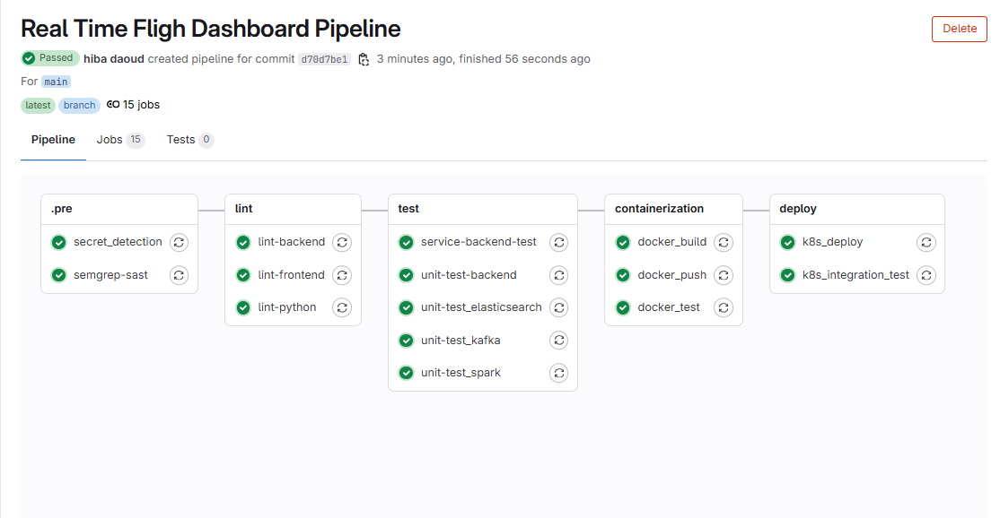

The figure below shows the Microsoft Azure Kubernetes cluster that hosts all the service pods and allows scalable deployment.

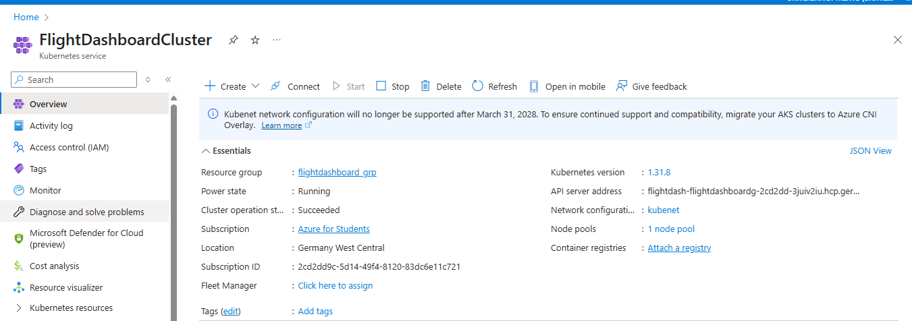

The figure below shows the final deployment result, where our web application is accessible through a public domain name using Ingress: **flight-dashboard.nip.io**.

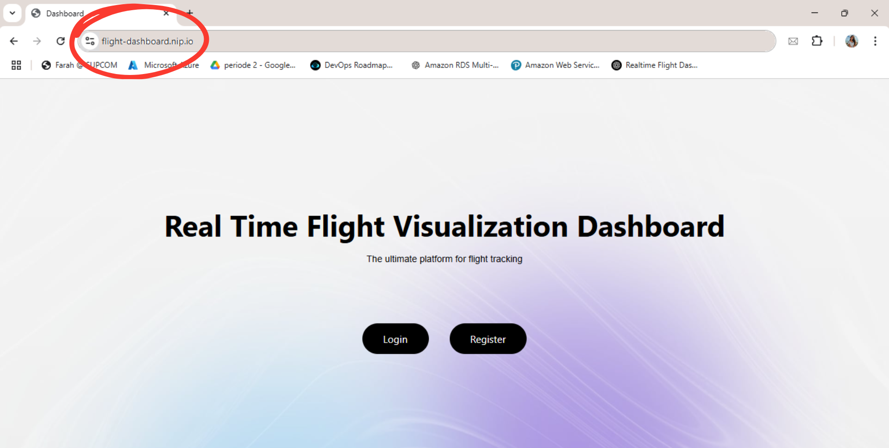

---

**⇒ Conclusion:**  
These results confirm that the system fulfills the main goal of the project: enabling fast, safe, and automated deployments of a real-time application. The CI/CD pipeline ensures that every update is built, tested, and deployed reliably to the cloud. Thanks to Kubernetes, services are deployed step by step (rolled out) across the cluster to ensure stability, scaled effectively under load, and rolled back in case of failure, guaranteeing both availability and resilience in production. Moreover, with Ingress configured, the application is now publicly accessible via the domain **flight-dashboard.nip.io**, offering users a seamless way to interact with the live system.

### 📊 Monitoring & Observability Results and Evaluation
To validate cluster sizing and ensure efficient resource usage, the monitoring stack was used to track **CPU and memory consumption at both pod and node levels**. The objective was to identify over- or under-provisioning, tune Kubernetes resource requests and limits, and verify system stability under load.

This section summarizes the observed resource usage patterns and highlights the impact of tuning decisions on cluster performance and reliability.

#### **Ressource allocation:**
To define realistic and cost-efficient values, **stress tests** were executed to simulate concurrent user activity. CPU and memory usage were monitored using **Prometheus metrics** and **Grafana dashboards**. Based on these observations, requests and limits were tuned per service, guiding the sizing of the Azure production cluster.

The figures below show the values defined for each service along with current usage.

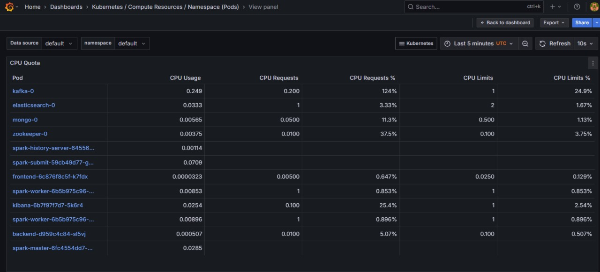

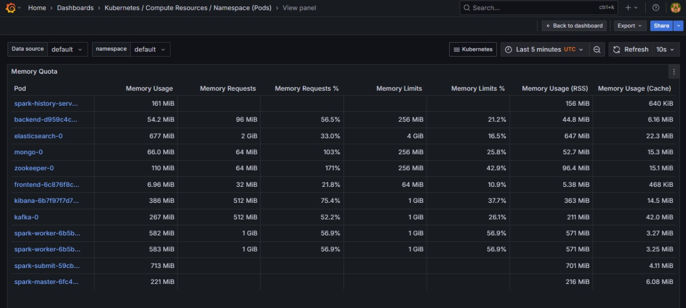

#### **Aggregate Utilization During Peak Load**

After applying the tuned values, stress tests were executed again to evaluate overall efficiency across all service pods.

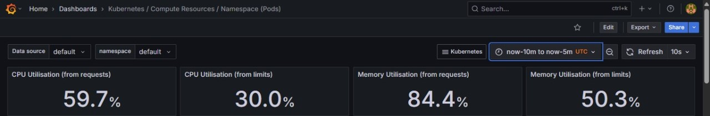

During peak load, all pods together utilized about **60% of their requested CPU** and **85% of their requested memory**, corresponding to **30% of total CPU limits** and **50% of memory limits**. This indicates that all pods remained well within their quotas.

**Insight:**  
This utilization rate shows that the cluster sizing was well-balanced, providing enough headroom to handle traffic bursts while minimizing wasted capacity and reducing the risk of resource exhaustion or out-of-memory (OOM) errors.

#### **Real-Time Utilization Patterns**

Figure below provides a detailed view of CPU consumption patterns for individual services during idle and peak periods.

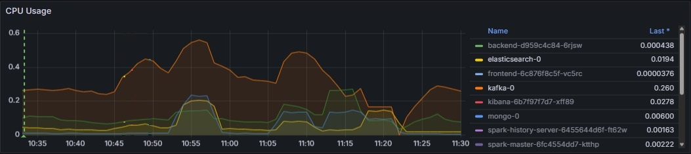

Kafka showed the highest CPU usage during peak load (up to 0.5–0.6 CPU cores), reflecting its central role in ingesting and distributing streaming data.  
Backend and Spark pods showed CPU usage spikes during processing phases but stabilized quickly when the workload subsided.  
Frontend, Kibana, and Elasticsearch maintained consistently low CPU utilization, indicating that most computation occurs within the processing layers.

**Insight:**  
This pattern confirms the effectiveness of the resource allocation strategy: compute-intensive services (Kafka, Spark) were provisioned with higher CPU requests and limits, while frontend and visualization components operated with lower guarantees.


Similarly, memory utilization was closely monitored.

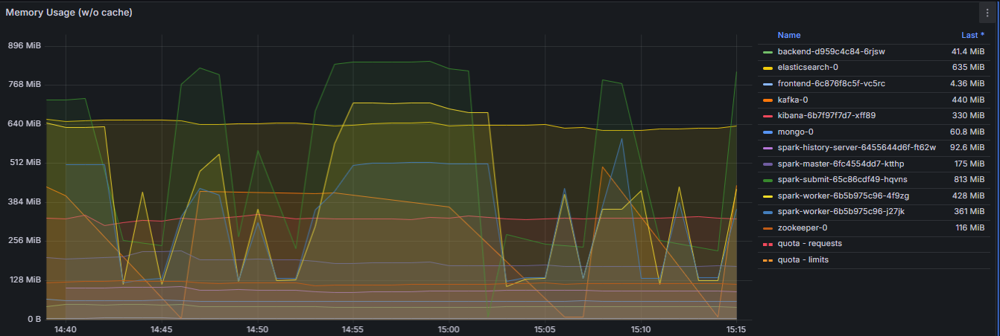

Spark workers, Spark submit jobs, and Elasticsearch showed the highest memory consumption, reaching over **800 MiB** and **600 MiB** respectively, which is expected for data-intensive processing and indexing components.  
Frontend and backend services consumed minimal memory (below 100 MiB), confirming that memory resources should primarily be allocated to processing and storage services.

**Insight:**  
Memory-intensive services (Spark, Elasticsearch) were provisioned with higher memory requests and limits, reducing the risk of OOM errors and ensuring stable performance.

#### **Node-Level Resource Utilization**

Beyond pod-level metrics, node-level CPU and memory usage was analyzed to account for system processes (Linux OS, kubelet), container runtime overhead, and monitoring agents. As a result, total node usage may exceed the sum of pod requests and limits.

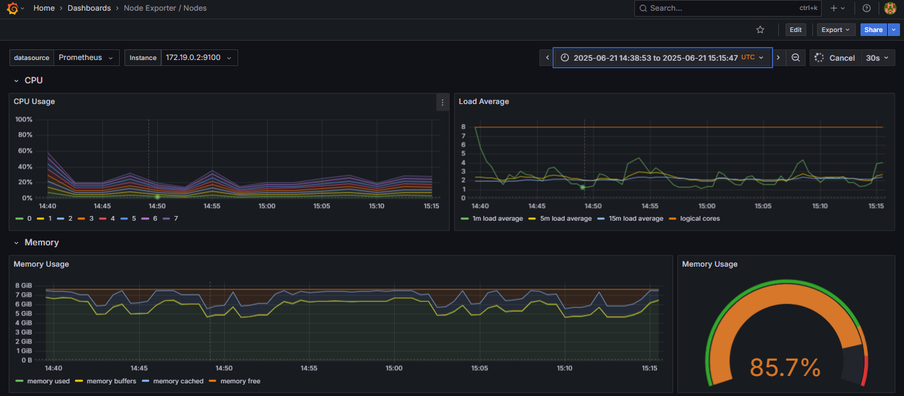

Overall CPU usage remained moderate, confirming that the node could comfortably support application workloads. Memory usage reached approximately **85%**, reflecting combined application, system, and monitoring overhead.

**Insight:**  
Node-level monitoring is critical to detect system saturation risks. Even under peak load, sufficient CPU and memory headroom was maintained, validating the effectiveness of resource planning at the infrastructure level.

---

**➜ Conclusion:**  
Based on these observations, an Azure Kubernetes cluster with **3 worker nodes**, each equipped with **2 vCPUs and 8 GB RAM**, was provisioned. This configuration provides sufficient capacity to support system services and varying workloads while maintaining performance and stability.


## 🔮 Limitations & Future Considerations
- **Resource Constraints**: Due to limited Azure budget, both service-level and cluster-level resources were intentionally kept minimal. While sufficient for small-scale deployments, this configuration may not fully support high-traffic production workloads.

- **Scalability Potential**: With additional cloud resources, the system can be horizontally scaled to handle increased traffic and higher data volumes without architectural changes.

- **Auto-Scaling Integration**: Future work includes implementing **Horizontal Pod Autoscaling (HPA)** based on real-time CPU and memory metrics to enable dynamic scaling without manual intervention.

- **Advanced Security (DevSecOps)**: Strengthening the security posture by integrating DevSecOps practices such as:
  - Secure secret management
  - Automated vulnerability scanning
  - Container image verification
  - Kubernetes network policies for cluster hardening

- **Production Readiness Enhancements**: Additional improvements may include more granular monitoring, alerting mechanisms, and cost-optimization strategies to support long-term production use.


